# Bandit Walkthrough

## Level 0
The goal of this level is for you to log into the game using SSH. The host to which you need to connect is bandit.labs.overthewire.org, on port 2220. The username is bandit0 and the password is bandit0. Once logged in, go to the Level 1 page to find out how to beat Level 1.
### Commands you may need to solve this level
ssh

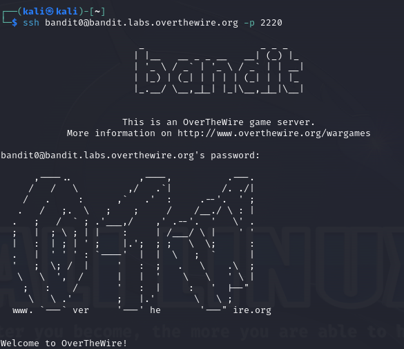

## Level 0 - Level 1
The password for the next level is stored in a file called readme located in the home directory. Use this password to log into bandit1 using SSH. Whenever you find a password for a level, use SSH (on port 2220) to log into that level and continue the game.
### Commands you may need to solve this level
ls , cd , cat , file , du , find

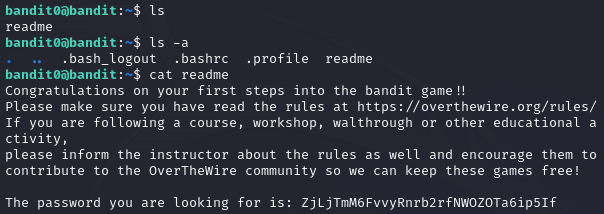

## Level 1 - Level 2
The password for the next level is stored in a file called - located in the home directory
### Commands you may need to solve this level
ls , cd , cat , file , du , find

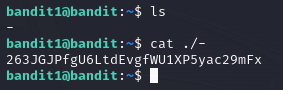

## Level 2 - Level 3
The password for the next level is stored in a file called spaces in this filename located in the home directory
### Commands you may need to solve this level
ls , cd , cat , file , du , find

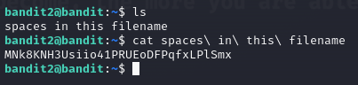

## Level 3 - Level 4
The password for the next level is stored in a hidden file in the inhere directory.
### Commands you may need to solve this level
ls , cd , cat , file , du , find

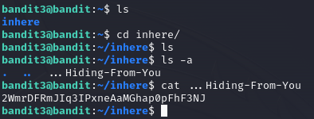

## Level 4 - Level 5
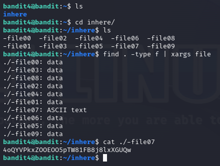

## Level 5 - Level 6
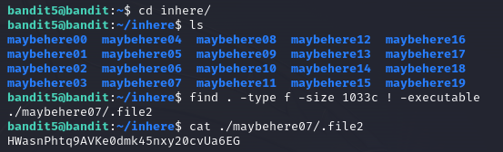

## Level 6 - Level 7
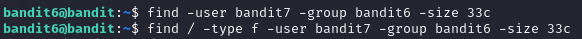
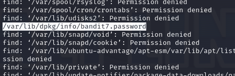
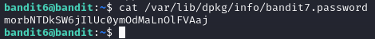

## Level 7 - Level 8
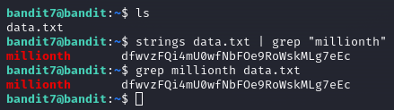

## Level 8 - Level 9
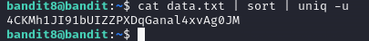

## Level 9 - Level 10
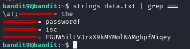

## Level 10 - Level 11
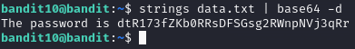

## Level 11 - Level 12
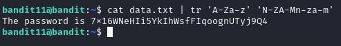

## Level 12 - Level 13
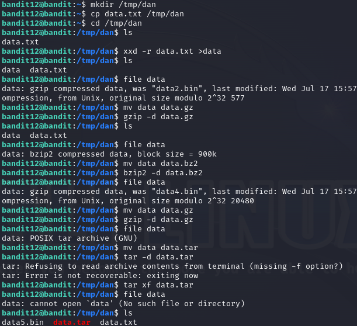
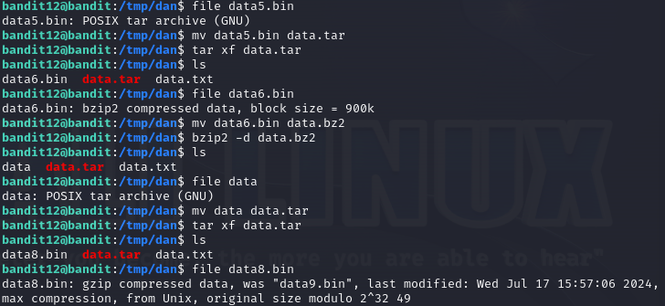
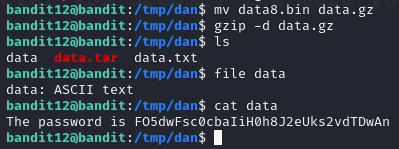

## Level 13 - Level 14
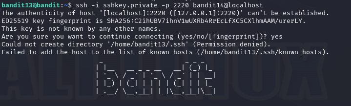

## Level 14 - Level 15
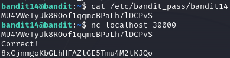

## Level 15 - Level 16
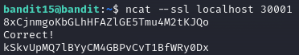

## Level 16 - Level 17
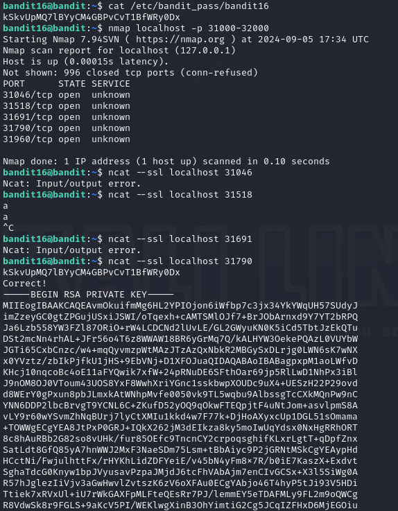

## Level 17 - Level 18
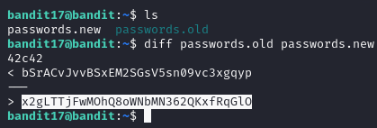

## Level 18 - Level 19
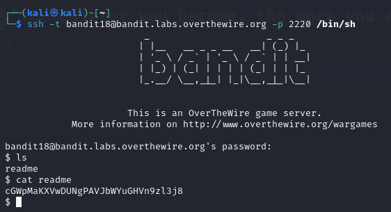

## Level 19 - Level 20
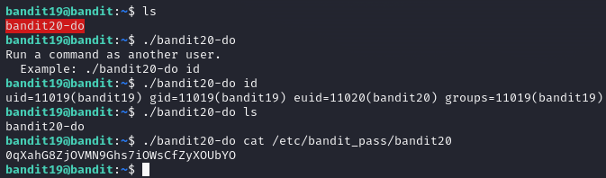

## Level 20 - Level 21
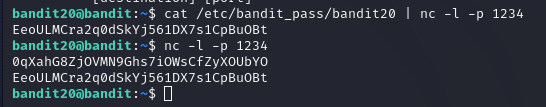
one terminal listens for current password to let out next level's password
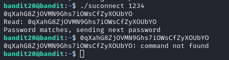

## Level 21 - Level 22

## Level 22 - Level 23
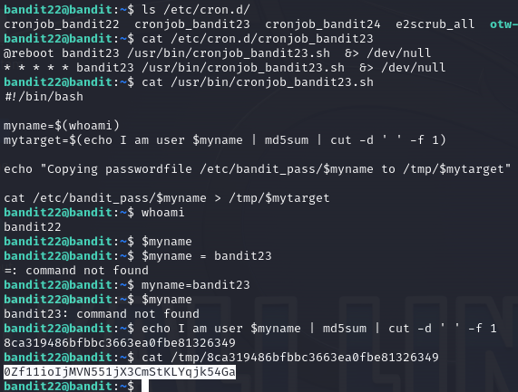

## Level 23 - Level 24
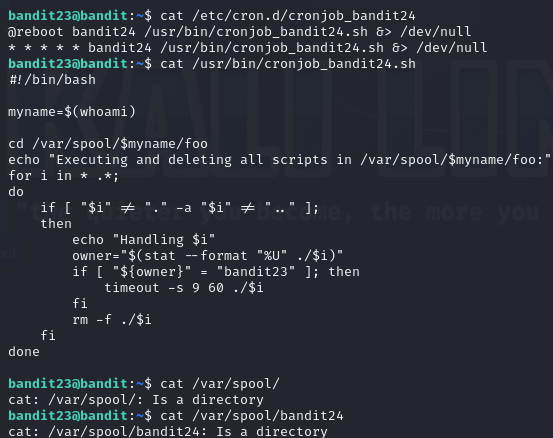
cron program executes after a minute on its own

## Level 24 - Level 25
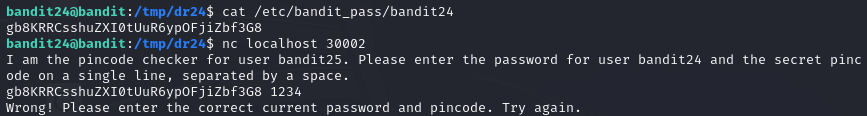
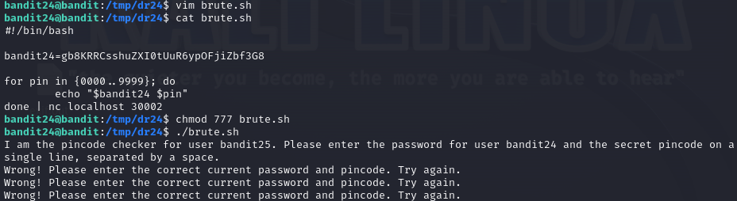
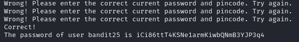

## Level 25 - Level 26
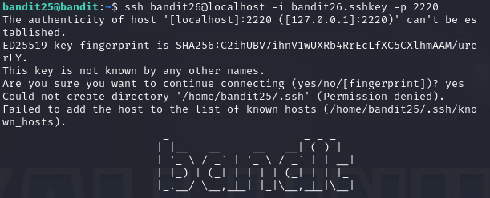
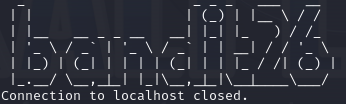
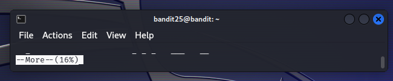
type v to enter vim

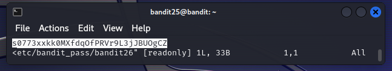

## Level 26 - Level 27
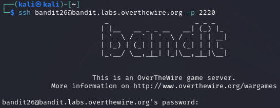
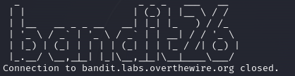
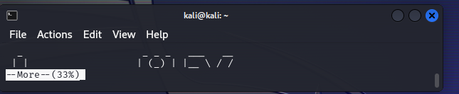
type v to enter vim
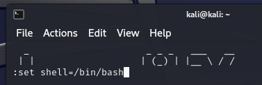
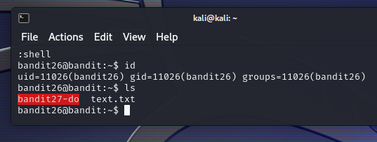
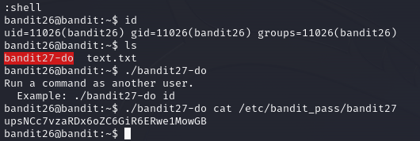

## Level 27 - Level 28
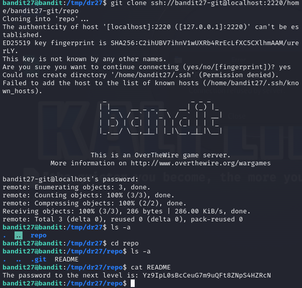

## Level 28 - Level 29
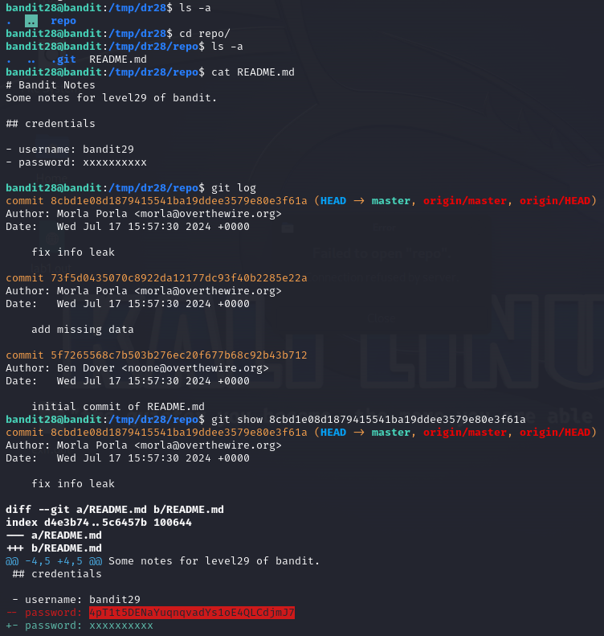

## Level 29 - Level 30
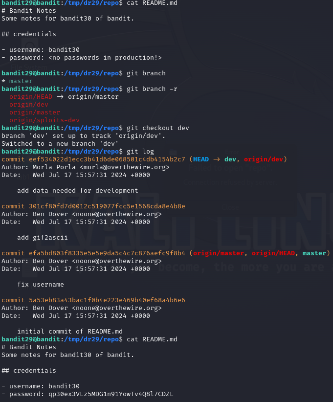

## Level 30 - Level 31

reference level 29:

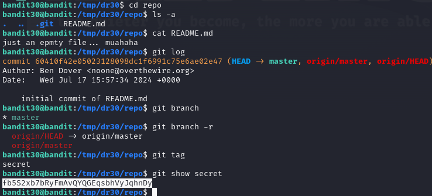

## Level 31 - Level 32

reference level 29:

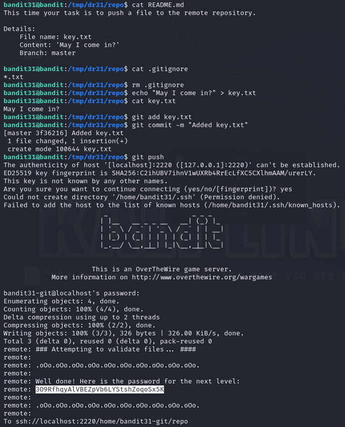

## Level 32 - Level 33

reference level 29:

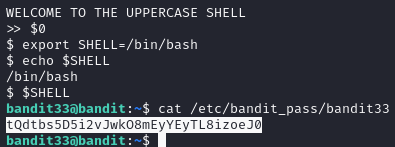
