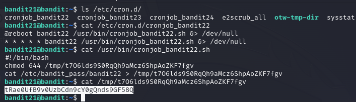

# Bandit Walkthrough

## Level 0
The goal of this level is for you to log into the game using SSH. The host to which you need to connect is bandit.labs.overthewire.org, on port 2220. The username is bandit0 and the password is bandit0. Once logged in, go to the Level 1 page to find out how to beat Level 1.
### Commands you may need to solve this level
ssh

## Level 0 - Level 1
The password for the next level is stored in a file called readme located in the home directory. Use this password to log into bandit1 using SSH. Whenever you find a password for a level, use SSH (on port 2220) to log into that level and continue the game.
### Commands you may need to solve this level
ls , cd , cat , file , du , find

## Level 1 - Level 2
The password for the next level is stored in a file called - located in the home directory
### Commands you may need to solve this level
ls , cd , cat , file , du , find

## Level 2 - Level 3
The password for the next level is stored in a file called spaces in this filename located in the home directory
### Commands you may need to solve this level
ls , cd , cat , file , du , find

## Level 3 - Level 4
The password for the next level is stored in a hidden file in the inhere directory.
### Commands you may need to solve this level
ls , cd , cat , file , du , find

## Level 4 - Level 5
The password for the next level is stored in the only human-readable file in the inhere directory. Tip: if your terminal is messed up, try the “reset” command.
### Commands you may need to solve this level
ls , cd , cat , file , du , find

## Level 5 - Level 6
The password for the next level is stored in a file somewhere under the inhere directory and has all of the following properties:
human-readable
1033 bytes in size
not executable
### Commands you may need to solve this level
ls , cd , cat , file , du , find

## Level 6 - Level 7
The password for the next level is stored somewhere on the server and has all of the following properties:
owned by user bandit7
owned by group bandit6
33 bytes in size
### Commands you may need to solve this level
ls , cd , cat , file , du , find , grep

## Level 7 - Level 8
The password for the next level is stored in the file data.txt next to the word millionth
### Commands you may need to solve this level
man, grep, sort, uniq, strings, base64, tr, tar, gzip, bzip2, xxd

## Level 8 - Level 9
The password for the next level is stored in the file data.txt and is the only line of text that occurs only once
### Commands you may need to solve this level
grep, sort, uniq, strings, base64, tr, tar, gzip, bzip2, xxd

## Level 9 - Level 10
The password for the next level is stored in the file data.txt in one of the few human-readable strings, preceded by several ‘=’ characters.
### Commands you may need to solve this level
grep, sort, uniq, strings, base64, tr, tar, gzip, bzip2, xxd

## Level 10 - Level 11
The password for the next level is stored in the file data.txt, which contains base64 encoded data
### Commands you may need to solve this level
grep, sort, uniq, strings, base64, tr, tar, gzip, bzip2, xxd

## Level 11 - Level 12
The password for the next level is stored in the file data.txt, where all lowercase (a-z) and uppercase (A-Z) letters have been rotated by 13 positions
### Commands you may need to solve this level
grep, sort, uniq, strings, base64, tr, tar, gzip, bzip2, xxd

## Level 12 - Level 13
The password for the next level is stored in the file data.txt, which is a hexdump of a file that has been repeatedly compressed. For this level it may be useful to create a directory under /tmp in which you can work. Use mkdir with a hard to guess directory name. Or better, use the command “mktemp -d”. Then copy the datafile using cp, and rename it using mv (read the manpages!)
### Commands you may need to solve this level
grep, sort, uniq, strings, base64, tr, tar, gzip, bzip2, xxd, mkdir, cp, mv, file

## Level 13 - Level 14
The password for the next level is stored in /etc/bandit_pass/bandit14 and can only be read by user bandit14. For this level, you don’t get the next password, but you get a private SSH key that can be used to log into the next level. Note: localhost is a hostname that refers to the machine you are working on
### Commands you may need to solve this level
ssh, telnet, nc, openssl, s_client, nmap

## Level 14 - Level 15
The password for the next level can be retrieved by submitting the password of the current level to port 30000 on localhost.
### Commands you may need to solve this level
ssh, telnet, nc, openssl, s_client, nmap

## Level 15 - Level 16
The password for the next level can be retrieved by submitting the password of the current level to port 30001 on localhost using SSL/TLS encryption.

Helpful note: Getting “DONE”, “RENEGOTIATING” or “KEYUPDATE”? Read the “CONNECTED COMMANDS” section in the manpage.
### Commands you may need to solve this level
ssh, telnet, nc, ncat, socat, openssl, s_client, nmap, netstat, ss

## Level 16 - Level 17
The credentials for the next level can be retrieved by submitting the password of the current level to a port on localhost in the range 31000 to 32000. First find out which of these ports have a server listening on them. Then find out which of those speak SSL/TLS and which don’t. There is only 1 server that will give the next credentials, the others will simply send back to you whatever you send to it.

Helpful note: Getting “DONE”, “RENEGOTIATING” or “KEYUPDATE”? Read the “CONNECTED COMMANDS” section in the manpage.
### Commands you may need to solve this level
ssh, telnet, nc, ncat, socat, openssl, s_client, nmap, netstat, ss

## Level 17 - Level 18
There are 2 files in the homedirectory: passwords.old and passwords.new. The password for the next level is in passwords.new and is the only line that has been changed between passwords.old and passwords.new

NOTE: if you have solved this level and see ‘Byebye!’ when trying to log into bandit18, this is related to the next level, bandit19
### Commands you may need to solve this level
cat, grep, ls, diff

## Level 18 - Level 19
The password for the next level is stored in a file readme in the homedirectory. Unfortunately, someone has modified .bashrc to log you out when you log in with SSH.
### Commands you may need to solve this level
ssh, ls, cat

## Level 19 - Level 20
To gain access to the next level, you should use the setuid binary in the homedirectory. Execute it without arguments to find out how to use it. The password for this level can be found in the usual place (/etc/bandit_pass), after you have used the setuid binary.

## Level 20 - Level 21
There is a setuid binary in the homedirectory that does the following: it makes a connection to localhost on the port you specify as a commandline argument. It then reads a line of text from the connection and compares it to the password in the previous level (bandit20). If the password is correct, it will transmit the password for the next level (bandit21).
### Commands you may need to solve this level
ssh, nc, cat, bash, screen, tmux, Unix ‘job control’ (bg, fg, jobs, &, CTRL-Z, …)

one terminal listens for current password to let out next level's password

## Level 21 - Level 22
A program is running automatically at regular intervals from cron, the time-based job scheduler. Look in /etc/cron.d/ for the configuration and see what command is being executed.
### Commands you may need to solve this level
cron, crontab, crontab(5) (use “man 5 crontab” to access this)

## Level 22 - Level 23
A program is running automatically at regular intervals from cron, the time-based job scheduler. Look in /etc/cron.d/ for the configuration and see what command is being executed.

NOTE: Looking at shell scripts written by other people is a very useful skill. The script for this level is intentionally made easy to read. If you are having problems understanding what it does, try executing it to see the debug information it prints.
### Commands you may need to solve this level
cron, crontab, crontab(5) (use “man 5 crontab” to access this)

## Level 23 - Level 24
A program is running automatically at regular intervals from cron, the time-based job scheduler. Look in /etc/cron.d/ for the configuration and see what command is being executed.

NOTE: This level requires you to create your own shell-script.

NOTE 2: Keep in mind that your shell script is removed once executed, so you may want to keep a copy around…
### Commands you may need to solve this level
chmod, cron, crontab, crontab(5) (use “man 5 crontab” to access this)

cron program executes after a minute on its own

## Level 24 - Level 25
A daemon is listening on port 30002 and will give you the password for bandit25 if given the password for bandit24 and a secret numeric 4-digit pincode. There is no way to retrieve the pincode except by going through all of the 10000 combinations, called brute-forcing.
You do not need to create new connections each time

## Level 25 - Level 26
Logging in to bandit26 from bandit25 should be fairly easy… The shell for user bandit26 is not /bin/bash, but something else. Find out what it is, how it works and how to break out of it.
### Commands you may need to solve this level
ssh, cat, more, vi, ls, id, pwd

type v to enter vim

## Level 26 - Level 27
Good job getting a shell! Now hurry and grab the password for bandit27!
### Commands you may need to solve this level
ls

type v to enter vim

## Level 27 - Level 28
There is a git repository at ssh://bandit27-git@localhost/home/bandit27-git/repo via the port 2220. The password for the user bandit27-git is the same as for the user bandit27.

Clone the repository and find the password for the next level.
### Commands you may need to solve this level
git

## Level 28 - Level 29
There is a git repository at ssh://bandit28-git@localhost/home/bandit28-git/repo via the port 2220. The password for the user bandit28-git is the same as for the user bandit28.

Clone the repository and find the password for the next level.
### Commands you may need to solve this level
git

after cloning

## Level 29 - Level 30
There is a git repository at ssh://bandit29-git@localhost/home/bandit29-git/repo via the port 2220. The password for the user bandit29-git is the same as for the user bandit29.

Clone the repository and find the password for the next level.
### Commands you may need to solve this level
git

## Level 30 - Level 31
There is a git repository at ssh://bandit30-git@localhost/home/bandit30-git/repo via the port 2220. The password for the user bandit30-git is the same as for the user bandit30.

Clone the repository and find the password for the next level.
### Commands you may need to solve this level
git

reference level 29, more to this level, figure out on your own:

## Level 31 - Level 32
There is a git repository at ssh://bandit31-git@localhost/home/bandit31-git/repo via the port 2220. The password for the user bandit31-git is the same as for the user bandit31.

Clone the repository and find the password for the next level.
### Commands you may need to solve this level
git

reference level 29, more to this level, figure out on your own:

## Level 32 - Level 33
Time for another escape. Good luck!
### Commands you may need to solve this level
sh, man

